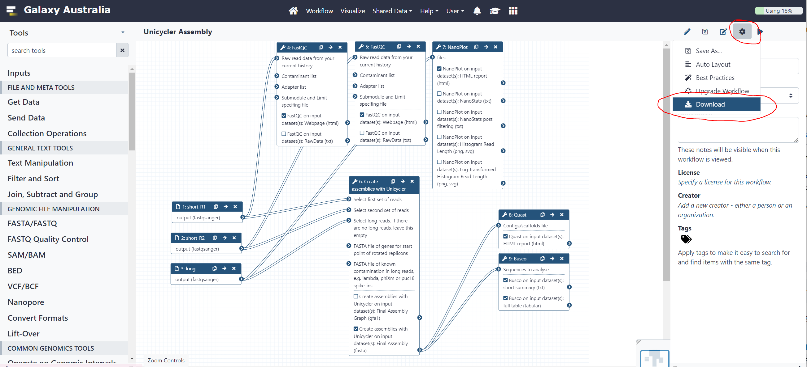

# RNA-Seq Reads to Counts Translation

## Introduction

This tutorial demonstrates translation of a Galaxy workflow to Nextflow using `janis translate`. 

The workflow we will translate in this tutorial accepts raw RNA-seq reads as input, and produces gene counts for further analysis (eg. differential expression).


<br>


**Source Workflow**

The workflow used in this tutorial is taken from the [Galaxy Training Network (GTN)](https://training.galaxyproject.org/training-material/) resource which provides tutorials on how to use Galaxy for bioinformatic analysis. 

The GTN has over 100 tutorials demonstrating how to use the Galaxy platform to analyse data, and is definitely worth having a look! 

The specific workflow we use today is from the [RNA-Seq reads to counts](https://training.galaxyproject.org/training-material/topics/transcriptomics/tutorials/rna-seq-reads-to-counts/tutorial.html) page, which provides detailed instruction on how to turn raw RNA-seq reads into gene counts. <br>


<br>

**Tutorial Outcomes**

In this tutorial we will:
- Install the required software
- Obtain the Galaxy workflow
- Translate the Galaxy workflow to Nextflow using `janis translate`
- Make manual adjustments to the translation where needed
- Run the Nextflow workflow using sample input data to validate our translation

After completing this short tutorial, you will be familiar with using `janis translate` to migrate workflows in Galaxy to Nextflow.

Other tutorials exist to demonstrate migration from WDL / CWL / Galaxy -> Nextflow in this repository.

<br>

**Installation**

To begin, make sure you have [nextflow](https://nf-co.re/usage/installation), [docker](https://docs.docker.com/engine/install/), and [janis translate](https://janis.readthedocs.io/en/latest/index.html) installed. <br>
The links above contain installation instructions. 

<br>

## Janis Translate

**Obtain the Workflow**

Galaxy workflows can be found in a number of places. 

Today, we will use the workflow provided from the GTN RNA-Seq reads to counts tutorial. <br>
The workflow can be downloaded using [this link](https://training.galaxyproject.org/training-material/topics/transcriptomics/tutorials/rna-seq-reads-to-counts/workflows/rna-seq-reads-to-counts.ga).

The downloaded `.ga` workflow is also included in the local `source/` folder if needed. 

<br>

*(for your information)*

Galaxy servers each have [shared workflows](https://usegalaxy.org.au/workflows/list_published) where you can search for a community workflow which suits your needs. The link above is to the Galaxy Australia server shared workflows page, which contains hundreds of workflows which users have made public. 


<br>

The [Galaxy Training Network (GTN)](https://training.galaxyproject.org/training-material/) also provides workflows for their training tutorials. These are useful because the topics covered are common analyses users wish to perform. 


<br>

Additionally, you can create your own workflow using the [Galaxy Workflow Editor](https://usegalaxy.org.au/workflows/list) then download your creation. 




<br>

**Run Janis Translate**

To translate a workflow,  we use `janis translate`.

```
janis translate --from <src> --to <dest> <filepath>
```

The `--from` specifies the workflow language of the source file(s), and `--to` specifies the destination we want to translate to. 

In our case, we want to translate Galaxy -> Nextflo. <br>
Our source Galaxy file is wherever you downloaded the `.ga` to, or alternatively at `source/rna-seq-reads-to-counts.ga` relative to this document.

<br>

*using pip*

To translate `rna-seq-reads-to-counts.ga` to nextflow, we can write the following in a shell:
```
janis translate --from galaxy --to nextflow source/rna-seq-reads-to-counts.ga
```

*using docker (linux bash)*

If the janis translate docker container is being used, we can write the following:
```
docker run -v $(pwd):/home janis translate --from galaxy --to nextflow source/rna-seq-reads-to-counts.ga
```

<br>

**Translation Output**

The output translation will contain multiple files and directories.<br>
You will see a folder called `translated` appear - inside this folder, we should see the following structure:

```
translated
├── main.nf                             # main workflow (rna_seq_reads_to_counts)
├── modules                             # folder containing nextflow processes
│   ├── collection_column_join.nf
│   ├── cutadapt.nf
│   ├── fastqc.nf
│   ├── featurecounts.nf
│   ├── hisat2.nf
│   ├── multiqc.nf
│   ├── picard_mark_duplicates.nf
│   ├── rseqc_gene_body_coverage.nf
│   ├── rseqc_infer_experiment.nf
│   ├── rseqc_read_distribution.nf
│   └── samtools_idxstats.nf
├── nextflow.config                     # config file to supply input information
├── source                              # folder containing galaxy tool wrappers used to translate tools
├── subworkflows                        # folder containing nextflow subworkflows
└── templates                           # folder containing any scripts used by processes
    ├── collection_column_join_script
    └── multiqc_config
```

Now we have performed translation using `janis translate`, we need to check the translated workflow for correctness.  

From here, we will do a test-run of the workflow using sample data, and make manual adjustments to the translated workflow where needed. 

<br>

## Running the Translated Workflow

<br>

**Inspect main.nf**

The main workflow translation appears as `main.nf` in the `translated/` folder. <br>

This filename is just a convention, and we use it to provide clarity about the main entry point of the workflow. <br>
In our case `main.nf` holds the nextflow definition for the  `rna-seq-reads-to-counts.ga` workflow. 

> NOTE: <br>
> Before continuing, feel free to have a look at the other nextflow files which have been generated during translation:<br>
> Each Galaxy tool appears as a nextflow process in the `translated/modules/` directory. 
> Each script used by nextflow processes appear in the `translated/templates/` directory.
> Each Galaxy Tool Wrapper used during translation appears in the `translated/source/` directory. 

In `main.nf` we see imports for nextflow processes called by the main workflow:

```
include { FASTQC as FASTQC1 } from './modules/fastqc'
include { CUTADAPT } from './modules/cutadapt'
include { FASTQC as FASTQC2 } from './modules/fastqc'
include { HISAT2 } from './modules/hisat2'
include { FEATURECOUNTS } from './modules/featurecounts'
include { PICARD_MARK_DUPLICATES } from './modules/picard_mark_duplicates'
include { SAMTOOLS_IDXSTATS } from './modules/samtools_idxstats'
include { RSEQC_GENE_BODY_COVERAGE } from './modules/rseqc_gene_body_coverage'
include { RSEQC_INFER_EXPERIMENT } from './modules/rseqc_infer_experiment'
include { RSEQC_READ_DISTRIBUTION } from './modules/rseqc_read_distribution'
include { COLLECTION_COLUMN_JOIN } from './modules/collection_column_join'
include { MULTIQC } from './modules/multiqc'
```

We also see that some nextflow `Channels` have been set up. <br>
These are used to supply data according to nextflow's adoption of the *dataflow* programming model.
```
// data which will be passed as channels
ch_collection_column_join_script  = Channel.fromPath( params.collection_column_join_script )
ch_in_input_fastqs_collection     = Channel.fromPath( params.in_input_fastqs_collection ).toList()
ch_in_input_reference_gene_bed    = Channel.fromPath( params.in_input_reference_gene_bed )
ch_multiqc_config                 = Channel.fromPath( params.multiqc_config )
```

> Note: `.toList()` <br><br>
> Nextflow queue channels work differently to lists. <br>
> Instead of supplying all items together, queue channels emit each item separately. <br> 
> This results in a separate task being spawned for each item in the queue when the channel is used. <br>
> As the Galaxy workflow specifies the `in_input_fastqs_collection` is a list of fastq files, we use `.toList()` to group all items as a sole emission. <br>
> This mimics an array which is the datatype of the `in_input_fastqs_collection` input. <br><br>
> As it turns out, the Galaxy workflow ends up running most steps in parallel across the `in_input_fastqs_collection` input. <br><br>
> Parallelisation in nextflow happens by default. <br>
> To facilitate this, the `.flatten()` method is called on `ch_in_input_fastqs_collection` when used in the `FASTQC1` and `CUTADAPT` tasks. <br>
> This emits items in `ch_in_input_fastqs_collection` individually, spawning a new task for each file. <br><br>
> Because other tasks use the output of `CUTADAPT`, they will also run in parallel per file.<br>
> We're kinda doing redundant work by calling `.toList()`, then `.flatten()`, but `janis translate` isn't smart enough yet to detect this at present. 

<br>

Now that we have covered imports and dataflow, we can look at the main `workflow` section. The main workflow is captured in the `workflow {}` section and has 12 tasks. 

Each task has been supplied values according to the source workflow. <br>
Comments display the name of the process input which is being fed a particular value. 

Compare the main `workflow {}` section with the following visualisation of our Galaxy workflow (using the Galaxy workflow editor).

main.nf
```
workflow {

    FASTQC1(
        ch_in_input_fastqs_collection.flatten()  // input_file
    )

    CUTADAPT(
        ch_in_input_fastqs_collection.flatten()  // library_input_1
    )

    FASTQC2(
        CUTADAPT.out.out1  // input_file
    )

    HISAT2(
        CUTADAPT.out.out1  // library_input_1
    )

    FEATURECOUNTS(
        HISAT2.out.output_alignments  // alignment
    )

    PICARD_MARK_DUPLICATES(
        HISAT2.out.output_alignments  // INPUT
    )

    SAMTOOLS_IDXSTATS(
        HISAT2.out.output_alignments  // inputFile
    )

    RSEQC_GENE_BODY_COVERAGE(
        HISAT2.out.output_alignments,   // batch_mode_input
        ch_in_input_reference_gene_bed  // option_r
    )

    RSEQC_INFER_EXPERIMENT(
        HISAT2.out.output_alignments,   // option_i
        ch_in_input_reference_gene_bed  // option_r
    )

    RSEQC_READ_DISTRIBUTION(
        HISAT2.out.output_alignments,   // option_i
        ch_in_input_reference_gene_bed  // option_r
    )

    COLLECTION_COLUMN_JOIN(
        FEATURECOUNTS.out.output_short.toList(),  // input_tabular
        ch_collection_column_join_script          // collection_column_join_script
    )

    MULTIQC(
        ch_multiqc_config,                            // config
        FASTQC2.out.out_text_file,                    // unknown1
        CUTADAPT.out.out_report,                      // unknown2
        RSEQC_INFER_EXPERIMENT.out.outputFile,        // unknown3
        PICARD_MARK_DUPLICATES.out.out_metrics_file,  // unknown4
        SAMTOOLS_IDXSTATS.out.outputFile,             // unknown5
        RSEQC_GENE_BODY_COVERAGE.out.outputtxt,       // unknown6
        RSEQC_READ_DISTRIBUTION.out.outputFile,       // unknown7
        FEATURECOUNTS.out.output_summary,             // unknown8
        HISAT2.out.out_summary_file                   // unknown9
    )

}
```

<br>

Galaxy Workflow


<br>

Now that we have looked at `main.nf`, let's run the translated Nextflow workflow. 
To do this we will supply sample data as inputs using the global `params` variables in `nextflow.config`.

<br>

**Inspect nextflow.config**

To test the translated workflow, we will first set up workflow inputs in `nextflow.config`. 

Before running a workflow, nextflow will attempt to open `nextflow.config` and read in config information and global *param* variables from this file. 
We use this file to tell nextflow how to run and to supply workflow inputs.

Inside the `translated/` folder you will see that `nextflow.config` is already provided. 

Janis translate creates this file to provide clarity about the necessary workflow inputs, and to set some other config variables. 

Open `nextflow.config` and have a look at the contents. It should look similar to the following: 

```
nextflow.enable.dsl=2
docker.enabled = true

params {
    
    // Placeholder for null values.
    // Do not alter unless you know what you are doing.
    NULL_VALUE = 'NULL'

    // WORKFLOW OUTPUT DIRECTORY
    outdir  = './outputs'

    // INPUTS (MANDATORY)
    collection_column_join_script  = NULL_VALUE  // (MANDATORY generic file)  
    in_input_fastqs_collection     = []          // (MANDATORY array)         eg. [file1, ...]
    in_input_reference_gene_bed    = NULL_VALUE  // (MANDATORY generic file)  
    multiqc_config                 = NULL_VALUE  // (MANDATORY generic file)  

}
```

> NOTE: `NULL_VALUE = 'NULL'`<br><br>
> Nextflow doesn't like `null` values to be passed to process inputs. <br>
> This is a challenge for translation as other languages allow `optional` inputs. <br>
> To get around this, Janis Translate sets the `params.NULL_VALUE` variable as a `null` placeholder for `val` type inputs. <br>
> You will see this being used in nextflow processes to do optionality checking.

<br>

The auto-generated `nextflow.config` splits up workflow inputs using some headings. <br>
Here, all our inputs are mandatory, so we see the following heading: 
```
// INPUTS (MANDATORY)
```
If our workflow had inputs which were optional, we would see them under this heading:

```
// INPUTS (OPTIONAL)
```

<br>

**Setting up Workflow Inputs**

We need to supply values for those under the `// INPUTS (MANDATORY)` heading. 
Specifically, we need to provide sample data for the following:
```
- collection_column_join_script     # script which the collection_column_join process will run
- in_input_fastqs_collection        # .fastq format input reads
- in_input_reference_gene_bed       # .bed format gene annotations
- multiqc_config                    # script which the multiqc process will run
```

Sample data for the `.fastq` and `.bed` inputs have been provided in the `sample_data` directory at the top level of this repository. 

The scripts will have been copied by `janis translate` and placed in the `translated/templates` folder. 

Copy and paste the following text to supply values for these inputs in your current `nextflow.config` file.

```
    // INPUTS (MANDATORY)
    collection_column_join_script  = "templates/collection_column_join_script" 
    in_input_fastqs_collection     = [
        "../../../../sample_data/galaxy/rnaseq_reads_to_counts_workflow/MCL1-DG-basalvirgin.fastq.gz",
        "../../../../sample_data/galaxy/rnaseq_reads_to_counts_workflow/MCL1-DH-basalvirgin.fastq.gz",
        "../../../../sample_data/galaxy/rnaseq_reads_to_counts_workflow/MCL1-DI-basalpregnant.fastq.gz",
        "../../../../sample_data/galaxy/rnaseq_reads_to_counts_workflow/MCL1-DJ-basalpregnant.fq.gz",
        "../../../../sample_data/galaxy/rnaseq_reads_to_counts_workflow/MCL1-DK-basallactate.fastq.gz",
        "../../../../sample_data/galaxy/rnaseq_reads_to_counts_workflow/MCL1-DL-basallactate.fastq.gz",
        "../../../../sample_data/galaxy/rnaseq_reads_to_counts_workflow/MCL1-LA-luminalvirgin.fastq.gz",
        "../../../../sample_data/galaxy/rnaseq_reads_to_counts_workflow/MCL1-LB-luminalvirgin.fastq.gz",
        "../../../../sample_data/galaxy/rnaseq_reads_to_counts_workflow/MCL1-LC-luminalpregnant.fastq.gz",
        "../../../../sample_data/galaxy/rnaseq_reads_to_counts_workflow/MCL1-LD-luminalpregnant.fastq.gz",
        "../../../../sample_data/galaxy/rnaseq_reads_to_counts_workflow/MCL1-LE-luminallactate.fastq.gz",
        "../../../../sample_data/galaxy/rnaseq_reads_to_counts_workflow/MCL1-LF-luminallactate.fastq.gz",
    ]
    in_input_reference_gene_bed    = "../../../../sample_data/galaxy/rnaseq_reads_to_counts_workflow/ucsc/mm10_RefSeq.bed"
    multiqc_config                 = "templates/multiqc_config"
```

<br>


**Run the Workflow**

Ensure you are in the `translated/` working directory, where `nextflow.config` and `main.nf` reside. 

If not, use the following to change directory. 
```
cd translated/
```

To run the workflow using our sample data, we can now write the following command: 
```
nextflow run main.nf
```

While the workflow runs, you will encounter this error:

```
Caused by:
  Missing output file(s) `out1*` expected by process `CUTADAPT (10)`

Command executed:
  cutadapt     MCL1-LD-luminalpregnant.fastq.gz
```

This is somewhat expected. Janis translate doesn't produce perfect translations - just the best it can do. <br>
This is the first of ***?*** errors we will encounter and fix while making this workflow runnable. 


<br>

## Manual Adjustments

### Error 1: Cutadapt

The first issue we need to address is caused by the cutadapt process translation. 

**Error message**
```
Caused by:
  Missing output file(s) `out1*` expected by process `CUTADAPT (10)`

Command executed:
  cutadapt     MCL1-LD-luminalpregnant.fastq.gz
```

This message tells us that a file called `out1*` should have been present in the working directory, but could not be found. 

>Note<br>
>Nextflow supports ***wildcards*** wherever paths are used. <br>
>Here, `out1*` will collect any file which starts with `out1`, as `*` matches any text. 

<br>

**Diagnosing the Error**

The software manual for a particular tool is a good place to start.
In our case, the [cutadapt user guide](https://cutadapt.readthedocs.io/en/stable/guide.html) tells us what arguments we need to supply. 

From this documentation, we see that the basic usage is as follows
```
cutadapt -a AACCGGTT -o output.fastq input.fastq
```

Further down the cutadapt documentation, we see that the report will be printed to stdout. <br>
We want our script section to resemble the following:
```
cutadapt -a AACCGGTT -o output.fastq input.fastq > report.txt
```

<br>


When diagnosing these types of errors, its always a good idea to look at the process working directory. <br>
Nextflow will provide this path any time a process encounters an error. 

Navigate to this folder. You should see something similar to these files:
```
- .command.begin
- .command.err                      # stderr
- .command.log
- .command.out                      # stdout
- .command.run
- .command.sh                       # the shell command which was executed
- .exitcode
- MCL1-LD-luminalpregnant.fastq.gz
```

We can see that the input `.fastq.gz` file was localised to the working directory, but there is no `out1*` or `report.txt` file which we expect. 

<br>

Open `.command.sh` to view the command which was run. It should be similar to the following:
```
#!/bin/bash -ue
cutadapt     MCL1-LD-luminalpregnant.fastq.gz
```

We see that `cutadapt` is being run on the input file, but we aren't capturing any output. <br>
Open `.command.out` to view stdout. In this case, we see the 'trimmed' reads:
```
@SRR1552447.1 DCV4KXP1:223:C2CTUACXX:1:1101:2099:2233 length=100
GGAAATCCTGAAGAAGATTATTGATATGATCAAGTACATCCAATATCAACAGGTCACCATCCCCCAACTTCCNCAANCTCNTCATCCCCAGATACCTGTG
...
```

<br>

It seems there are a few issues: 
- Our process is missing an input for an adapter sequence to trim
- Our shell command is missing the `-a` and `-o` arguments
- We are not redirecting stdout to a report file

<br>

**Solution**

Update your `CUTADAPT` process definition in `modules/cutadapt.nf`. 

- Add a new `val` process input called `adapters` to accept adapter sequences
- Modify the `script:` section to include the `-a` argument and pass the `${adapters}` input as its value
- Modify the `script:` section to include the `-o` argument and pass `${library_input_1.simpleName}_cutadapt.fastq.gz` as its value
- Modify the `script:` section to pipe stdout to `${library_input_1.simpleName}_cutadapt_report.txt`
- Modify the `outputs:` section so that out1 collects `${library_input_1.simpleName}_cutadapt.fastq.gz`
- Modify the `outputs:` section so that out_report collects `${library_input_1.simpleName}_cutadapt_report.txt`

Your process definition should now look similar to the following: 

```
process CUTADAPT {
    
    container "quay.io/biocontainers/cutadapt:1.16--py35_2"
    publishDir "${params.outdir}/cutadapt"

    input:
    path library_input_1
    val adapter

    output:
    path "${library_input_1.simpleName}_cutadapt.fastq.gz", emit: out1
    path "${library_input_1.simpleName}_cutadapt_report.txt", emit: out_report

    script:
    """
    cutadapt \
    -a ${adapter} \
    -o ${library_input_1.simpleName}_cutadapt.fastq.gz \
    ${library_input_1} \
    > ${library_input_1.simpleName}_cutadapt_report.txt
    """

}
```

<br>

>NOTE <br>
>Why were these `cutadapt` arguments missed? <br><br>
>The default setting for `janis translate` is to translate tools according to their usage in the workflow. <br>
>This is because Galaxy Tool Wrappers are complex and often have many inputs - most of which aren't relevant to the workflow being translated. <br><br>
>To get the extended tool translation we can use `--mode full` when running janis translate:
>```
>janis translate --from galaxy --to nextflow source/rna_seq_reads_to_counts.ga --mode full
>```
>
>For the `CUTADAPT` process, it will now look similar to the following: 
>```
>nextflow.enable.dsl=2
>
>process CUTADAPT {
>    
>    container "quay.io/biocontainers/cutadapt:1.16--py35_2"
>    publishDir "${params.outdir}/cutadapt"
>
>    input:
>    path library_input_1
>    path info_file
>    path output_file
>    path paired_output
>    path rest_file
>    path too_long_output
>    path too_long_paired_output
>    path too_short_output
>    path too_short_paired_output
>    path untrimmed_output
>    path untrimmed_paired_output
>    path wildcard_file
>    val discard
>    val discard_untrimmed
>    val mask_adapter
>    val match_read_wildcards
>    val no_indels
>    val no_trim
>    val trim_n
>    val error_rate
>    val length
>    val length_tag
>    val max_n
>    val maximum_length
>    val minimum_length
>    val nextseq_trim
>    val option_j
>    val option_u
>    val option_u
>    val overlap
>    val pair_filter
>    val prefix
>    val quality_cutoff
>    val read1
>    val read2
>    val suffix
>    val times
>
>    output:
>    path "out1*", emit: out1
>    path "out2*", emit: out2
>    path "info_file.txt", emit: out_info_file
>    path "report.txt", emit: out_report
>    path "rest_output.fastqsanger", emit: out_rest_output
>    path "too_long_output.fastqsanger", emit: out_too_long_output
>    path "too_long_paired_output.fastqsanger", emit: out_too_long_paired_output
>    path "too_short_output.fastqsanger", emit: out_too_short_output
>    path "too_short_paired_output.fastqsanger", emit: out_too_short_paired_output
>    path "untrimmed_output.fastqsanger", emit: out_untrimmed_output
>    path "untrimmed_paired_output.fastqsanger", emit: out_untrimmed_paired_output
>    path "wild_output.txt", emit: out_wild_output
>
>    script:
>    def info_file = info_file.simpleName != params.NULL_VALUE ? "--info-file=${info_file}" : ""
>    def output_file = output_file.simpleName != params.NULL_VALUE ? "--output=${output_file}" : ""
>    def paired_output = paired_output.simpleName != params.NULL_VALUE ? "--paired-output=${paired_output}" : ""
>    def rest_file = rest_file.simpleName != params.NULL_VALUE ? "--rest-file=${rest_file}" : ""
>    def too_long_output = too_long_output.simpleName != params.NULL_VALUE ? "--too-long-output=${too_long_output}" : ""
>    def too_long_paired_output = too_long_paired_output.simpleName != params.NULL_VALUE ? "--too-long-paired-output=${too_long_paired_output}" : ""
>    def too_short_output = too_short_output.simpleName != params.NULL_VALUE ? "--too-short-output=${too_short_output}" : ""
>    def too_short_paired_output = too_short_paired_output.simpleName != params.NULL_VALUE ? "--too-short-paired-output=${too_short_paired_output}" : ""
>    def untrimmed_output = untrimmed_output.simpleName != params.NULL_VALUE ? "--untrimmed-output=${untrimmed_output}" : ""
>    def untrimmed_paired_output = untrimmed_paired_output.simpleName != params.NULL_VALUE ? "--untrimmed-paired-output=${untrimmed_paired_output}" : ""
>    def wildcard_file = wildcard_file.simpleName != params.NULL_VALUE ? "--wildcard-file=${wildcard_file}" : ""
>    def discard = discard ? "--discard" : ""
>    def discard_untrimmed = discard_untrimmed ? "--discard-untrimmed" : ""
>    def mask_adapter = mask_adapter ? "--mask-adapter" : ""
>    def match_read_wildcards = match_read_wildcards ? "--match-read-wildcards" : ""
>    def no_indels = no_indels ? "--no-indels" : ""
>    def no_trim = no_trim ? "--no-trim" : ""
>    def trim_n = trim_n ? "--trim-n" : ""
>    def error_rate = error_rate != params.NULL_VALUE ? error_rate : 0.1
>    def length = length != params.NULL_VALUE ? length : 0
>    def length_tag = length_tag != params.NULL_VALUE ? "--length-tag ${length_tag}" : ""
>    def max_n = max_n != params.NULL_VALUE ? "--max-n ${max_n}" : ""
>    def maximum_length = maximum_length != params.NULL_VALUE ? maximum_length : 0
>    def minimum_length = minimum_length != params.NULL_VALUE ? minimum_length : 0
>    def nextseq_trim = nextseq_trim != params.NULL_VALUE ? nextseq_trim : 0
>    def option_u = option_u != params.NULL_VALUE ? option_u : 0
>    def option_j = option_j != params.NULL_VALUE ? option_j : 1
>    def option_u = option_u != params.NULL_VALUE ? option_u : 0
>    def overlap = overlap != params.NULL_VALUE ? overlap : 3
>    def pair_filter = pair_filter != params.NULL_VALUE ? pair_filter : "any"
>    def prefix = prefix != params.NULL_VALUE ? "--prefix ${prefix}" : ""
>    def quality_cutoff = quality_cutoff != params.NULL_VALUE ? quality_cutoff : "0"
>    def read1 = read1 != params.NULL_VALUE ? read1 : ""
>    def read2 = read2 != params.NULL_VALUE ? read2 : ""
>    def suffix = suffix != params.NULL_VALUE ? "--suffix ${suffix}" : ""
>    def times = times != params.NULL_VALUE ? times : 1
>    """
>    cutadapt \
>    ${library_input_1} \
>    ${info_file} \
>    ${output_file} \
>    ${paired_output} \
>    ${rest_file} \
>    ${too_long_output} \
>    ${too_long_paired_output} \
>    ${too_short_output} \
>    ${too_short_paired_output} \
>    ${untrimmed_output} \
>    ${untrimmed_paired_output} \
>    ${wildcard_file} \
>    --error-rate ${error_rate} \
>    --length ${length} \
>    ${length_tag} \
>    ${max_n} \
>    --maximum-length ${maximum_length} \
>    --minimum-length ${minimum_length} \
>    --nextseq-trim ${nextseq_trim} \
>    --overlap ${overlap} \
>    --pair-filter ${pair_filter} \
>    ${prefix} \
>    --quality-cutoff ${quality_cutoff} \
>    ${suffix} \
>    --times ${times} \
>    -U ${option_u} \
>    -j ${option_j} \
>    -u ${option_u} \
>    ${discard} \
>    ${discard_untrimmed} \
>    ${mask_adapter} \
>    ${match_read_wildcards} \
>    ${no_indels} \
>    ${no_trim} \
>    ${trim_n} \
>    ${read1} \
>    ${read2} \
>    """
>
>}
>```
>
>In this case: 
>- The `--output` option is now present as `--output=${output_file}` when supplied
>- The `--adapter` option is not needed as we are using `--info-file=${info_file}` to supply adapter information


<br>

### Error 2: FastQC Outputs

The second error is due to output collection in the `FASTQC` process. 

**Error message**

```
Caused by:
  Missing output file(s) `output.html` expected by process `FASTQC1 (4)`

Command executed:
  fastqc     MCL1-DJ-basalpregnant.fq.gz
```

This is telling us that `output.html` was expected in the process working directory when collecting outputs, but could not be found. 

<br>

**Diagnosing the Error**

Similar to Error 1, let's have a look at the process working directory to see which files were created. 

It should look similar to the following: 
```
- .command.begin
- .command.err
- .command.log
- .command.out
- .command.run
- .command.sh
- .exitcode
- MCL1-DJ-basalpregnant.fq.gz -> [path to input data]
- MCL1-DJ-basalpregnant_fastqc.html
- MCL1-DJ-basalpregnant_fastqc.zip
```

Instead of producing `output.html`, we have produced `MCL1-DJ-basalpregnant_fastqc.html`.

It seems that (by default) FastQC produces a `.html` and `.zip` using the input file's base name and adding `_fastqc`.

We will modify the process `outputs:` section to collect these files instead. 

<br>

**Solution**

View the `FASTQC` process in `modules/fastqc.nf`.

We will change the output collection expressions so they capture the correct outputs. 

Modify the `outputs:` section to resemble the following: 
```
    output:
    path "${input_file.simpleName}_fastqc.html", emit: out_html_file
    path "${input_file.simpleName}_fastqc.zip", emit: out_text_file
```

<br>

### Error 3: Hisat2 Inputs

The 3rd error is due to difficulties in translating some Galaxy Tool Wrappers. 

**Error message**

```
Caused by:
  Process `HISAT2 (1)` terminated with an error exit status (1)

Command executed:
  hisat2     MCL1-DK-basallactate_cutadapt.fastq.gz
```

<br>

**Diagnosing the Error**

As in the previous errors, let's have a look at the process working directory. 

This time, we will look at `.command.err` which is the ***stderr*** of our command. Most command line software will print error messages to ***stderr***. 

The first lines of `.command.err` are hisat2-align telling us the command line format to run this software: 

```
Usage: 
  hisat2 [options]* -x <ht2-idx> {-1 <m1> -2 <m2> | -U <r>} [-S <sam>]
```
At the bottom of `.command.err` we see hisat2-align telling us what we missed in our command: 
```
Error: Must specify at least one read input with -U/-1/-2
(ERR): hisat2-align exited with value 1
```

From this information, we can gather that the `script:` section of our `HISAT2` process isn't formatted correctly. 

<br>

View the `HISAT2` process definition in `modules/hisat2.nf`. 
It should look similar to the following: 
```
process HISAT2 {
    
    container "quay.io/biocontainers/hisat2:2.2.1--h87f3376_5"
    publishDir "${params.outdir}/hisat2"

    input:
    path library_input_1

    output:
    path "summary.txt", emit: out_summary_file
    path "unknown_collection_pattern", emit: output_alignments

    script:
    """
    hisat2 \
    ${library_input_1} \
    """

}
```

The process definition has a few errors. 
- We need a new process input for the hisat2 index we will align against.
- We need to supply the hisat2 index using `-x` in the script section.
- As our reads are single-end, we need to supply these using `-U`in the script section. 

The is also an error with the `outputs:` section of the `HISAT2` process, but we will tackle this in the next error. 

>Note<br>
>Why didn't `janis translate` create a process input for the hisat2 index?<br><br>
>Galaxy Tool Wrappers can use inbuilt data on the Galaxy server when running tools. <br>
>In this case, the `hisat2` Galaxy Tool Wrapper uses prebuilt indexes which you can select using a dropdown.<br>
>As this happens internally and isn't part of the canonical `hisat2` software command, `janis translate` doesn't translate it. <br><br>
>In the future, `janis translate` may support inbuilt data. <br>
>Care needs to be taken due to the sheer size of these files.

<br>

**Solution**

To start, we will update the `HISAT2` process definition in `modules/hisat2.nf`. <br>
We will then add a new `hisat2_index` param in `nextflow.config`, and feed this value to `HISAT2` in `main.nf`


hisat2.nf:
- Add a new `path` process input called `index` to accept a hisat2 index
- Modify the `script:` section to include the `-x` argument and pass `${index[0].simpleName}` input as its value
- Modify the `script:` section to include the `-U` argument and pass `${library_input_1}` as its value

<br>

>Note:<br>
>Why use `${index[0].simpleName}` rather than `${index}`?<br>
>Hisat2 indexes come as multiple chunks, where each chunk is an individual file.<br>
>For example: hg38.1.ht2, hg38.2.ht2 .... etc. <br>
><br>
>This means that our `path index` input will be a list of files, rather than a single file.<br>
>When running Hisat2, we supply the basename of the index chunks, rather than a full filename. <br>
>For the example above, we would supply `-x hg38` as each chunk starts with this basename. <br>
>To do this, we use `index[0]` to get the filename of the first chunk, then `.simpleName` to get its basename. 

Your process definition should now look similar to the following: 

modules/hisat2.nf
```
process HISAT2 {
    
    container "quay.io/biocontainers/hisat2:2.2.1--h87f3376_5"
    publishDir "${params.outdir}/hisat2"

    input:
    path library_input_1
    path index

    output:
    path "summary.txt", emit: out_summary_file
    path "unknown_collection_pattern", emit: output_alignments

    script:
    """
    hisat2 \
    -x ${index[0].simpleName} \
    -U ${library_input_1} \
    """

}
```

<br>

Now we have fixed up our process definition, we need to pass data to this input in the workflow. 

Let's create a new `param` in `nextflow.config` to provide a path to the sample data:

nextflow.config
```
    ...
    multiqc_config  = "templates/multiqc_config" 
    adapter         = "AGATCGGAAGAGCACACGTCTGAACTCCAGTCAC"
    hisat2_index    = "../../../../sample_data/galaxy/rnaseq_reads_to_counts_workflow/hisat2_index/*.ht2"
```

>Note:<br>
>A wildcard is used - `*.ht2` - when specifying files to include as the `hisat2_index` param.<br>
>Nextflow supports glob patterns, so using the expression `*.ht2` will capture all the hisat2 index chunks which end in `.ht2` in the hisat2 index folder.

<br>

The last thing to do is feed the data to our `HISAT2` process in `main.nf`. <br>
We will create a channel to supply the index as a list, then use that channel in the `HISAT2` task call. 

Add a channel to the top of main.nf below the other channel definitions. 
It should look similar to the following: 

main.nf
```
...
// data which will be passed as channels
ch_collection_column_join_script  = Channel.fromPath( params.collection_column_join_script )
ch_in_input_fastqs_collection     = Channel.fromPath( params.in_input_fastqs_collection ).toList()
ch_in_input_reference_gene_bed    = Channel.fromPath( params.in_input_reference_gene_bed )
ch_multiqc_config                 = Channel.fromPath( params.multiqc_config )
ch_hisat2_index                   = Channel.fromPath( params.hisat2_index ).toList()        <- 
...
```

Now feed that channel to `HISAT2` in the workflow body:

```
HISAT2(
        CUTADAPT.out.out1,  // library_input_1
        ch_hisat2_index     // index                <- 
    )
```

<br>

After you have made these changes, re-run the nextflow workflow. 

From here, we will add the `-resume` flag so that previous tasks don't need to be executed:
```
nextflow run main.nf -resume
```

<br>

### Error 4: Hisat2 Outputs


